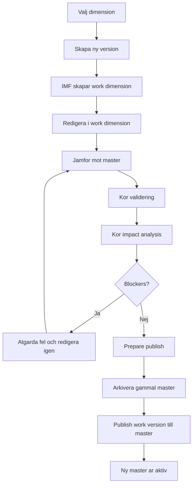

# IMF For Dummies

En enkel guide till hur man arbetar i Intito MasterFlow (IMF) som vanlig användare.

## Vad IMF ar

IMF ar ett arbetssatt for att andra masterdata i TM1 utan att skriva direkt i den skarpa master-dimensionen.

Grundideen ar:

1. du valjer en dimension som IMF hanterar
2. du skapar en arbetsversion
3. du redigerar arbetsversionen
4. IMF kontrollerar vad du andrat
5. IMF validerar att andringen ar okej
6. IMF publicerar arbetsversionen till master
7. den gamla mastern arkiveras automatiskt

Det betyder att man far kontroll, sparbarhet och mojlighet att backa tillbaka.

## De viktigaste orden

- `Master dimension`: den skarpa dimensionen som resten av modellen anvander
- `Work version`: en arbetskopia av mastern dar du gor dina andringar
- `Publish`: nar arbetsversionen ersatter master
- `Archive`: en sparad kopia av gamla master innan publish
- `Validation`: tekniska och affarsmassiga kontroller
- `Impact analysis`: analys av vad andringen kan paverka

## Enkel bild av flodet



## Hur man jobbar i IMF som anvandare

### 1. Valj dimension

I IMF jobbar man alltid med en dimension i taget, till exempel `Account`, `Product` eller `Organization`.

Dimensionen maste forst vara onboardad i IMF. Det betyder att den finns registrerad i IMF:s kontrollobjekt och har en definierad master-dimension.

### 2. Skapa en ny version

Nar du vill borja arbeta skapar du en ny version.

Detta gor IMF:

- skapar ett nytt versions-id, till exempel `V001` eller `2026_03_budget`
- skapar en work dimension enligt monster som `MasterDimensionName + VersionDelimiter + VersionId`
- kopierar inhall fran master till work dimension

Du kan skapa versionen pa tva satt:

- fran `MASTER`
- fran en annan befintlig `VERSION`

Praktiskt betyder det:

- `fran MASTER` anvands nar du vill borja fran senaste publicerade laget
- `fran VERSION` anvands nar du vill fortsatta pa nagon annans eller din egen tidigare arbetsversion

### 3. Redigera versionen

Redigeringen sker inte i masterdimensionen. Du redigerar i den work dimension som IMF skapade for versionen.

Detta ar ett viktigt tankesatt:

- master = lasbar sanning
- work version = arbetsyta

I PAW ar tanken att du valjer versionen och oppnar den i editing-vyn eller dimension editor.

Det ar dar du normalt:

- lagger till nya element
- andrar namn eller alias
- bygger om hierarkier
- flyttar element
- andrar attribut
- tar bort felaktiga eller gamla element

## Hur adderas nya dimensioner?

Det finns tva olika scenarier som ofta blandas ihop.

### Scenario A: ny version av en befintlig IMF-dimension

Detta ar det vanliga fallet.

Da skapar du inte en ny dimension i IMF. Du skapar bara en ny version av en dimension som redan ar onboardad.

Exempel:

- dimensionen `Product` finns redan i IMF
- du skapar `Product` version `V002`
- IMF skapar en work dimension for just den versionen

### Scenario B: en helt ny dimension ska borja hanteras av IMF

Detta ar onboarding av en ny managed dimension.

Da behovs ett steg innan vanliga anvandare kan jobba med den:

1. dimensionen registreras i `IMF.D.Dimension`
2. masterdimensionens namn anges
3. configvarden kopieras fran IMF:s template
4. fysisk dimension kan skapas om den inte redan finns
5. dimensionen blir valbar for versionshantering

Detta motsvarar IMF-processen `IMF.P.Dimension.Onboard`.

Kort sagt:

- ny version = business-as-usual for anvandare
- ny dimension = onboarding, oftast admin- eller implementationsteg

## Hur jobbar man med nya versioner?

Den enklaste arbetsrutinen ar:

1. skapa ny version
2. redigera work dimension
3. kor compare
4. kor validation
5. kor impact
6. publish nar allt ar godkant

Det finns ocksa nagra bra vanor:

- anvand tydliga versionsnamn
- jobba helst i en version per andringspaket
- undvik att flera personer andrar samma sak i flera parallella versioner utan samordning
- publicera inte utan att lasa validering och impact

## Hur sker editeringen?

Editeringen sker i IMF:s arbetskopia, inte i produktionsdimensionen.

Det betyder i praktiken:

- IMF skapar work dimensionen
- anvandaren oppnar work dimensionen i PAW eller relevant editor
- andringar goras dar
- IMF jamfor sedan work dimensionen mot master

Det fina med det ar att du kan jobba fritt utan att direkt paverka skarp drift.

En enkel mental modell ar:

- "Jag skissar i work"
- "Jag publicerar till master nar jag ar klar"

## Hur deployas en andrad dimension?

Har ar det viktigt att skilja pa tva olika saker.

### 1. Publish inne i IMF

Detta ar det som de flesta anvandare menar med att "deploya en dimension".

Flodet ar:

1. IMF kor `prepare publish`
2. IMF kor teknisk validering
3. IMF kor affarsvalidering
4. IMF kor impact analysis
5. om blockers finns stoppas publish
6. om allt ar okej arkiveras aktuell master
7. work dimension kopieras till master
8. versionen markeras som publicerad

Detta ar alltsa den funktionella deploymenten av masterdata.

### 2. Teknisk deploy av IMF-losningen till TM1

Detta ar nagot annat.

Det handlar om att deploya IMF:s processer, objektdefinitioner och tekniska artefakter fran repo till en TM1-miljo.

Detta gor man med `tools/tm1_deploy.py`, till exempel:

```powershell
python tools/tm1_deploy.py validate
python tools/tm1_deploy.py plan
python tools/tm1_deploy.py deploy-processes --deploy-objects --execute
```

Detta ar alltsa for utvecklare eller drift, inte den vanliga businessanvandarens dagliga arbete.

## Normal arbetsgang for en anvandare

Om man ska forklara IMF pa 30 sekunder kan man saga sa har:

"Vi andrar aldrig masterdimensionen direkt. Vi skapar en arbetsversion, gor andringarna dar, later IMF kontrollera vad som andrats och publicerar sedan till master nar allt ar godkant. Den gamla mastern sparas automatiskt sa att vi kan spora och rulla tillbaka."

## Snabbguide steg for steg

### Nar du ska andra en befintlig dimension

1. valj dimension
2. skapa en ny version
3. oppna editing-vyn
4. gor dina andringar i work dimensionen
5. kor compare
6. kor validation
7. kontrollera impact
8. publish
9. verifiera att ny master ser ratt ut

### Nar du ska lagga till en helt ny dimension i IMF

1. onboarda dimensionen i IMF
2. skapa eller koppla fysisk masterdimension
3. kontrollera att config ar seeded
4. skapa forsta versionen
5. redigera
6. validera
7. publish

## Vad stoppar en publish?

En publish ska stoppas om IMF hittar blocker-level problem, till exempel:

- tekniska fel i hierarkin
- tomma konsolideringar
- obligatoriska attribut som saknas
- affarsregler som inte ar uppfyllda
- approval som saknas om dimensionen kraver godkannande
- impact-fynd med blocker eller error

## Vad hander efter publish?

Efter publish hander detta:

- den tidigare mastern arkiveras
- den nya versionen blir master
- IMF sparar information om vilken version som senast publicerades
- det finns ett spar att ga tillbaka till om man behover rollback

## Enkelt exempel

Sak att du vill lagga till nya produkter.

Da gor du sa har:

1. valj dimensionen `Product`
2. skapa version `V003`
3. IMF skapar till exempel `Product_VER_V003`
4. oppna `Product_VER_V003` i editor
5. lagg till nya produkter och deras attribut
6. kor compare, validation och impact
7. publish
8. IMF arkiverar gamla `Product`
9. IMF ersatter `Product` med innehallet i `Product_VER_V003`

## Sammanfattning i en mening

IMF ar ett kontrollerat arbetsflode for att skapa, redigera, kontrollera och publicera dimensionsandringar utan att direkt jobba i skarp masterdata.
