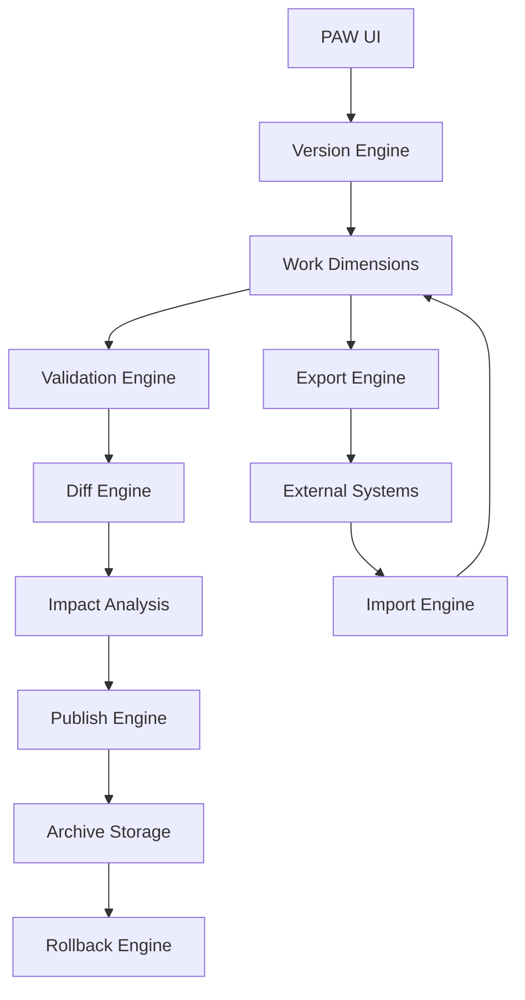

# Intito MasterFlow Architecture

This diagram shows the primary execution flow in IMF, from user interaction in PAW through versioning, validation, impact analysis, publish, archive, rollback, and external integration.

## Notes
- `PAW UI` is the primary business-facing control surface.
- `Work Dimensions` hold editable versioned structures before publish.
- `Validation Engine` and `Impact Analysis` act as release gates before publish and rollback.
- `Archive Storage` preserves the published master lineage for traceability and rollback.
