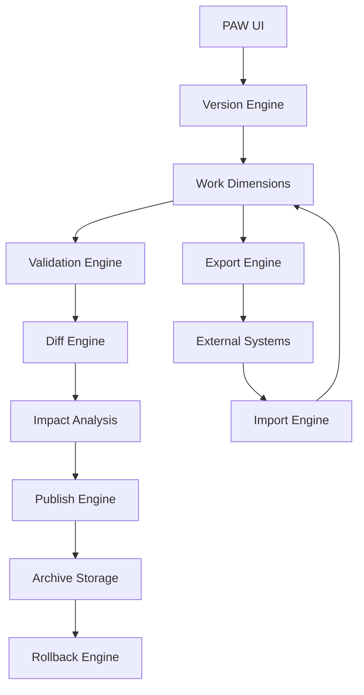

# Intito MasterFlow Architecture

```mermaid
flowchart TD

A[PAW UI] --> B[Version Engine]
B --> C[Work Dimensions]
C --> D[Validation Engine]
D --> E[Diff Engine]
E --> F[Impact Analysis]
F --> G[Publish Engine]
G --> H[Archive Storage]
H --> I[Rollback Engine]

C --> J[Export Engine]
J --> K[External Systems]

K --> L[Import Engine]
L --> C
```
